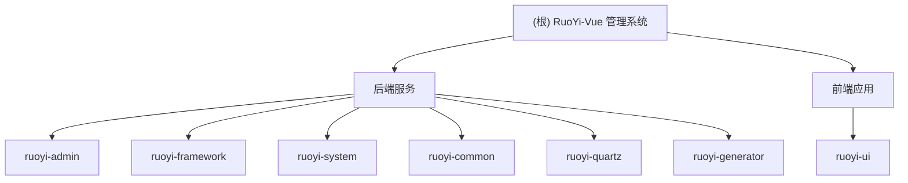

# RuoYi-Vue 项目文档

## 变更记录 (Changelog)

### 2025-08-30 16:29:18
- 初始化项目 AI 上下文
- 创建模块结构文档和导航体系
- 识别 7 个核心模块和关键配置

## 项目愿景

若依（RuoYi-Vue）是一套全部开源的快速开发平台，基于SpringBoot+Vue前后端分离架构。专注于为个人及企业提供免费的管理系统开发框架。

**核心特性：**
- 前后端分离：后端 Spring Boot + 前端 Vue.js + Element UI
- 权限管理：基于 JWT + Spring Security 的多终端认证
- 代码生成：一键生成前后端 CRUD 代码
- 丰富功能：用户管理、角色权限、系统监控、定时任务等

## 架构总览

### 技术栈
- **后端：** Spring Boot 2.5.15 + Spring Security + MyBatis + Redis
- **前端：** Vue 2.6.12 + Element UI 2.15.14 + Axios  
- **数据库：** MySQL + Redis
- **构建工具：** Maven (后端) + npm/Vue CLI (前端)

### 系统架构
```
RuoYi-Vue 系统架构
├── 前端层 (ruoyi-ui)     - Vue.js + Element UI
├── 网关层 (ruoyi-admin)  - Spring Boot Web 服务入口  
├── 业务层 (ruoyi-system) - 核心业务逻辑
├── 框架层 (ruoyi-framework) - 安全、缓存、数据源配置
├── 工具层 (ruoyi-common) - 通用工具和注解
├── 任务层 (ruoyi-quartz) - 定时任务调度
├── 生成层 (ruoyi-generator) - 代码自动生成
└── 数据层 (MySQL + Redis) - 数据存储和缓存
```

## 模块结构图



## 模块索引

| 模块名称 | 路径 | 类型 | 职责描述 | 状态 |
|---------|------|------|----------|------|
| ruoyi-admin | `./ruoyi-admin/` | Spring Boot App | Web服务入口，包含控制器和启动类 | ✅ 运行中 |
| ruoyi-ui | `./ruoyi-ui/` | Vue.js App | 前端用户界面，管理后台页面 | ✅ 运行中 |
| ruoyi-framework | `./ruoyi-framework/` | Framework | 核心框架层，安全配置和数据源 | ✅ 基础 |
| ruoyi-system | `./ruoyi-system/` | Business | 系统管理业务逻辑（用户、角色、权限） | ✅ 核心 |
| ruoyi-common | `./ruoyi-common/` | Library | 通用工具类、注解、异常处理 | ✅ 基础 |
| ruoyi-quartz | `./ruoyi-quartz/` | Scheduler | 定时任务调度功能 | ✅ 功能 |
| ruoyi-generator | `./ruoyi-generator/` | Tool | 代码生成工具 | ✅ 工具 |

## 运行与开发

### 环境要求
- **JDK：** 1.8+
- **Node.js：** 8.9+
- **MySQL：** 5.7+
- **Redis：** 3.0+
- **Maven：** 3.6+

### 快速启动

#### 后端启动
```bash
# 1. 导入数据库脚本
# 执行 sql/ry_20250522.sql 和 sql/quartz.sql

# 2. 修改数据库配置
# 编辑 ruoyi-admin/src/main/resources/application-druid.yml

# 3. 启动后端服务
cd ruoyi-admin
mvn spring-boot:run

# 或使用脚本
./ry.sh
```

#### 前端启动
```bash
# 1. 安装依赖
cd ruoyi-ui
npm install

# 2. 启动开发服务器
npm run dev

# 3. 构建生产版本
npm run build:prod
```

### 默认账号
- **管理员：** admin / admin123
- **演示地址：** http://vue.ruoyi.vip

## 测试策略

### 当前状态
- ❌ **单元测试：** 缺失，需要为业务逻辑添加 JUnit 测试
- ❌ **集成测试：** 缺失，需要 API 接口测试
- ❌ **前端测试：** 缺失，需要 Vue 组件测试
- ✅ **手工测试：** 通过演示环境验证功能

### 建议测试策略
1. **单元测试：** 对 Service 层业务逻辑进行测试覆盖
2. **接口测试：** 使用 Postman/Newman 或 Spring Test 进行 API 测试
3. **前端测试：** 使用 Vue Test Utils + Jest 进行组件测试
4. **端到端测试：** 使用 Cypress 进行关键业务流程测试

## 编码规范

### Java 后端
- **代码风格：** 遵循阿里巴巴 Java 编码规范
- **注释规范：** 类和方法必须包含完整 Javadoc
- **包命名：** com.ruoyi.{模块}.{分层}
- **异常处理：** 统一使用 ServiceException 和全局异常处理

### Vue 前端  
- **代码风格：** 使用 ESLint 标准配置
- **组件命名：** PascalCase，文件名使用 kebab-case
- **API 调用：** 统一使用 src/api 目录下的接口封装
- **状态管理：** 使用 Vuex 进行全局状态管理

### 数据库设计
- **表命名：** 使用下划线分隔，如 sys_user
- **字段命名：** 使用下划线分隔，如 user_name
- **主键：** 统一使用 {table}_id 格式
- **审计字段：** 包含 create_by, create_time, update_by, update_time

## AI 使用指引

### 代码开发辅助
1. **新增功能：** 参考现有的 CRUD 模式，使用代码生成器快速搭建
2. **API 开发：** 遵循 Controller -> Service -> Mapper 分层结构
3. **前端开发：** 参考 src/views 中现有页面的组件结构
4. **权限控制：** 使用 @PreAuthorize 注解和前端 v-hasPermi 指令

### 故障排查
1. **后端问题：** 查看 logs 目录下的日志文件
2. **数据库问题：** 检查 application-druid.yml 配置和 SQL 语句
3. **前端问题：** 使用浏览器开发者工具查看网络请求和控制台错误
4. **缓存问题：** 检查 Redis 连接和缓存策略

### 性能优化建议
1. **数据库优化：** 添加合适索引，优化慢查询
2. **缓存策略：** 合理使用 Redis 缓存热点数据
3. **前端优化：** 使用懒加载、代码分割等技术
4. **接口优化：** 实现分页查询，避免大数据量返回

## 相关链接

- **项目首页：** https://gitee.com/y_project/RuoYi-Vue
- **在线文档：** http://doc.ruoyi.vip  
- **演示地址：** http://vue.ruoyi.vip
- **问题反馈：** https://gitee.com/y_project/RuoYi-Vue/issues